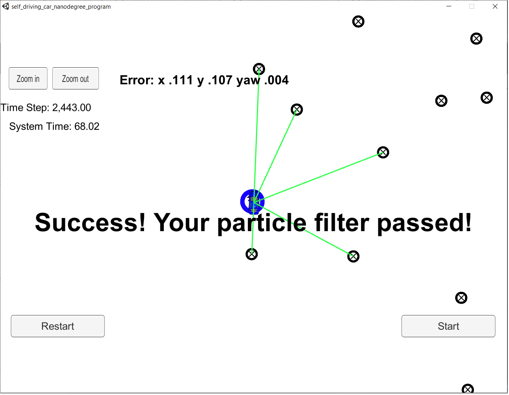

# Kidnapped Vehicle Localization Using Particle Filter
This Project aims to use the powerful tool of particle filter and with the help of a vehicle surrounding landmarks to estimate its 2D position with high accuracy. The vehicle uses GPS estimates as initial position. The project code is done in C++ and it requires the Self Driving Car Simulator for it to run. 

# Project Solution Method in Steps

The main code of this project is found in 'src' folder and in 'particle_filter.cpp'. The following steps can summarize how this filter works:- 

## Initilization. 
This step is done using the initialization function , in which it initilizes the number of particles as well as their first position according to the GPS location with gaussian distribution. 

## Prediction of the particles 
A prediction function is used in order to predict the position of the particles in the next time step based on previous position, velocity, yaw rate and heading. A random noise is added to this prediction step. 

## Updating Weights of the Particles
This includes the transformation of observation points from the vehicle coordinates to the map coordinates. Then the closest neighbor algorthim is used to find the nearest particle to each landmark. Then calculating weights for each mapped observation, and finally calculating the multi-variate Guassian distribution. 

## Resampling of particles. 
The particles are resampled based on the probability corrosponding to their weights distribution. 

## Finding the Opitimal Particle Number. 

* Particle Number: 20 , Error in Pos and Heading: (.140, .128, .004) System Time: 49 seconds

* Particle Number: 50 , Error in Pos and Heading: (.122, .113, .004) System Time: 52 seconds

* Particle Number: 100 , Error in Pos and Heading: (.117, .106, .004) System Time: 71 seconds

* Particle Number: 125 , Error in Pos and Heading: (.111, .107, .004) System Time: 68 seconds

* Particle Number: 150 , Error in Pos and Heading: (.110, .105, .004) System Time: 82 seconds

* Particle Number: 175 , Error in Pos and Heading: (.115, .105, .004) System Time: 89 seconds

* Particle Number: 200 , Error in Pos and Heading: (.115, .103, .004) System Time: 95 seconds


Based on the above tests all the time were done within 100 seconds (based on performance criteria. However, 125 particles seems to be the optimal number. it gives good accuracy while running relatively fast compared to the 150, 175 and 200. Moreover, the increase of particle numbers did not give a significant increase in accuracy after 125. Although in some cases we can see the opposite, (increase in error while increasing particle filter), this could be due to the small random errors. I don't think there's anything we can do about it. 




## Running the Code
This project involves the Term 2 Simulator which can be downloaded [here](https://github.com/udacity/self-driving-car-sim/releases)

This repository includes two files that can be used to set up and install uWebSocketIO for either Linux or Mac systems. For windows you can use either Docker, VMware, or even Windows 10 Bash on Ubuntu to install uWebSocketIO.

Once the install for uWebSocketIO is complete, the main program can be built and ran by doing the following from the project top directory.

1. mkdir build
2. cd build
3. cmake ..
4. make
5. ./particle_filter

Alternatively some scripts have been included to streamline this process, these can be leveraged by executing the following in the top directory of the project:

1. ./clean.sh
2. ./build.sh
3. ./run.sh


# Implementing the Particle Filter
The directory structure of this repository is as follows:

```
root
|   build.sh
|   clean.sh
|   CMakeLists.txt
|   README.md
|   run.sh
|
|___data
|   |   
|   |   map_data.txt
|   
|   
|___src
    |   helper_functions.h
    |   main.cpp
    |   map.h
    |   particle_filter.cpp
    |   particle_filter.h
```
